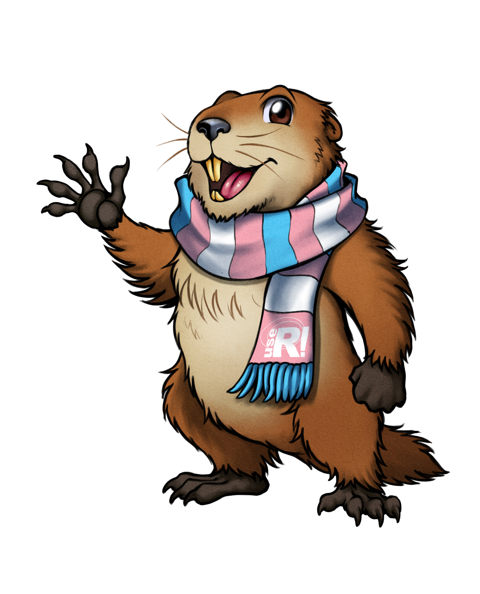

class: inverse, middle, center
background-image: url("figs/chevron.png")
background-position: 98% 2%
background-size: 150px

# Fun with R!
## sambaR
### Andrea Sánchez-Tapia <br> ¡liibre!
### R-Ladies+ East Lansing & R-Ladies+ Chicago<br><br> April 2021

---
background-image: url("figs/liibre.png")
background-position: 98% 2%
background-size: 150px

```{r setup, include=FALSE}
options(htmltools.dir.version = FALSE)
options(servr.daemon = TRUE)#para que no bloquee la sesión
library(xaringanthemer)
style_duo_accent(
  primary_color = "#A70000",
  secondary_color = "#A70000",
  colors = c(
    red = "#A70000",
    purple = "#88398a",
    orange = "#ff8811",
    green = "#136f63",
    blue = "#4B4FFF",
    white = "#FFFFFF",
    black = "#181818"
  ),
  text_bold_color = "#181818",
  header_font_google = google_font("Roboto Condensed"),
  text_font_google = google_font("Roboto Condensed", "300", "300i"),
  code_font_google = google_font("Fira Mono"), text_font_size = "28px"
)
```

### .red[About me]


+ __BSc. Biology__ - Universidad Nacional de Colombia <br> __MSc. in Ecology__ - Rio de Janeiro Federal University <br> __PhD. in Botany__ - Rio de Janeiro Botanical Garden

--

+ Biodiversity informatics, ecological niche modeling, restoration ecology, quantitative ecology 

--

+ I use R since 2009 and belong to __.purple[R-Ladies+ Rio de Janeiro]__ since 2017


--

+ __Open, responsible and reproducible science__, [data feminism](http://datafeminism.io/)

--

+ __.red[¡liibre!]__ .red[Independent Lab of Biodiversity Informatics and Reproducibility in Ecology"], co-founded with __Dr. Sara Mortara__ 


---
background-image: url("figs/chevron.png")
background-position: 98% 2%
background-size: 150px

### Grad course _Data analysis projects using R_

.pull-left[

```{r, echo = FALSE, out.width= 300}
knitr::include_graphics("./figs/turma.JPG")
```

__Good practices__ in data analysis
]


.pull-right[

```{r, echo = F, out.width=250}
knitr::include_graphics("./figs/rstudio.jpg")

```

```{r, echo = F, out.width= 100}
knitr::include_graphics("./figs/logo_git.png")
knitr::include_graphics("./figs/logo_github.png")
knitr::include_graphics("./figs/logo_gitlab.png")
```

```{r, echo = F, out.width= 120}
knitr::include_graphics("./figs/latex.jpeg")
knitr::include_graphics("./figs/bibtex.jpeg")
knitr::include_graphics("./figs/zotero.svg")
```

```{r, echo = F, out.width= 100}
knitr::include_graphics("./figs/rmarkdown.png")
knitr::include_graphics("./figs/xaringan.png")
```
]

---
background-image: url("figs/chevron.png")
background-position: 98% 2%
background-size: 150px

### A brief history of sambaR

+ My native language is Spanish, that means I grew up <br> trying to understand foreign lyrics on the radio

--

+ Living in Brazil == _so much new music_ `r emo::ji("heart")`. Trying to explain your music in Spanish to your new friends and vice-versa

--

+ I came to the US were I have to explain music from __both countries__ to my newest friends T___T 


---
background-image: url("figs/chevron.png")
background-position: 98% 2%
background-size: 150px

### Getting the lyrics: `{genius}` package

+ Genius database: [https://genius.com/](https://genius.com/)

--

+ `{Genius}` package: https://josiahparry.com/post/2019-05-08-genius-learnr-tutorial/

--

+ `genius::genius_lyrics(artist, song, info = "all")`

--

+ Create a destination folder for the lyrics to avoid repeating calls to the genius API

--

+ Save a `.csv` file in a convenient location on disk

<large><center>
`r emojifont::emoji("tada")`


---
background-image: url("figs/chevron.png")
background-position: 98% 2%
background-size: 150px

### Translating the lyrics: `{googleLanguageR}`

+ Calls the 'Cloud Translation' API for detection and <br> translation of text <https://cloud.google.com/translate/>

--

+ IRL I am ___very___ afraid of APIs

--

+ You are charged* by character! 
  1. Don't make repeated calls -> save!
  2. Don't make same language translations -> detect language first! `{cld2}`

--

+ Locally: configure the API by going to your [cloud.google.com](cloud.google.com) account -> create a __json__ jey, configure your `.Renviron` with that key...


---
background-image: url("figs/chevron.png")
background-position: 98% 2%
background-size: 150px

### Practice other tools

+ Package building with `{usethis}`

+ Practice "shiny skills" . `r emo::ji("rolling")`  

+ Write a small __shiny__ app and learn how it should be included in a package `runExample()`

---


```{r, eval = T, message=F, warning=F}
# install.packages("remotes")
#remotes::install_github("liibre/sambaR")
library(sambaR)
library(googleLanguageR)
song <- translate_lyrics("chico buarque", "apesar de voce")
song
```

---


```{r, eval = T, message=F, warning=F}
# install.packages("remotes")
#remotes::install_github("liibre/sambaR")
library(sambaR)
library(googleLanguageR)
song <- translate_lyrics("chico buarque", "apesar de voce", "en")
song
```

---
background-image: url("figs/chevron.png")
background-position: 98% 2%
background-size: 150px

### Fun with R!

+ Fun is in the eyes of the beholder

--

+ Curiosity-driven projects help learning things a lot without the pressure for success

--

+ Don't let anyone tell you that you _need_ to do these kind of things to be better or improve __keep it fun__


---
background-image: url("figs/liibre.png")
background-position: 98% 2%
background-size: 150px

class: center

## Thank you!

`r icons::icon_style(icons::fontawesome("twitter") , fill = "#A70000")` [@SanchezTapiaA](https://twitter.com/SanchezTapiaA)   
 


Registration for __useR! 2021__ is open! 

```{r, echo=F, out.width=350}
knitr::include_graphics("figs/user_logo_COLOR.png")

```


